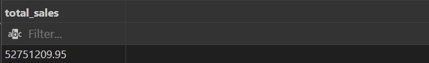
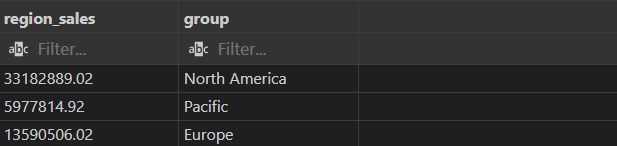
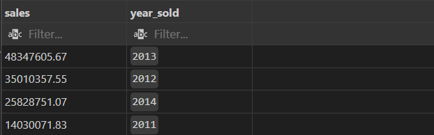
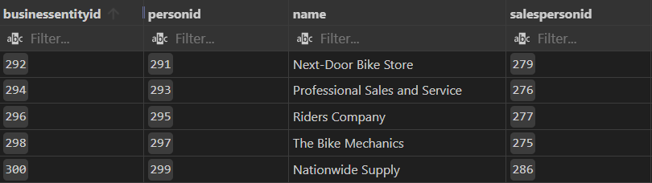
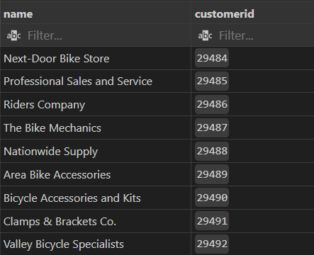
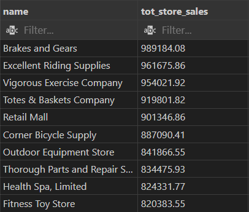
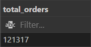
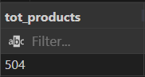
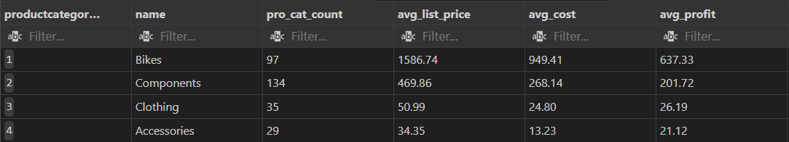
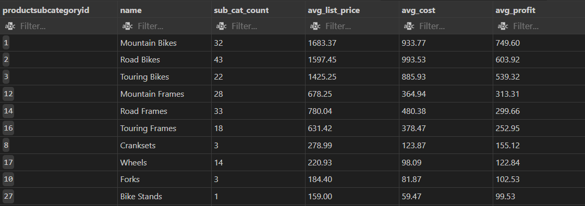

# Background
AdventureWorks is a large sample database provided by Microsoft for use in SQL Server. As a user of PostgreSql, I wanted to see if I could import it into PostgreSql and then write queries to analyse the data from a business perspective.

In order to import the data, I relied on this work done by [NorfolkDataSci](https://github.com/NorfolkDataSci/adventure-works-postgres), who were themselves adding to work done originally by [lorint](https://github.com/lorint/AdventureWorks-for-Postgres). Using the updated CSV files, I was able to use SQL Shell (PSQL) to load the install.sql file (after making adjustments to the filepaths) to load all of AdventureWorks onto my PostgreSql server.

# Tools I Used

- **SQL:** The backbone of my analysis, allowing me to query the database and unearth critical insights.
- **PostgreSQL:** A widely popular database management system. 
- **Visual Studio Code:** My go-to for database management and executing SQL queries.
- **Git & GitHub:** Essential for version control and sharing my SQL scripts and analysis, ensuring collaboration and project tracking. Also where I got the scripts used to import the dataset into PostgreSql.

Check out the SQL querys I used here: [AdventureWorks Queries](Adventureworks.session.sql)

# The Analysis
Each SQL query for this project aimed at identifying an interesting and useful buisiness-related observation about the large dataset:

### 1. Total Sales Amount
```sql
SELECT ROUND(SUM(salesterritory.salesytd),2) AS Total_Sales
FROM sales.salesterritory
```


### 2. Sales by Region
```sql
SELECT ROUND(SUM(salesterritory.salesytd),2) AS Region_Sales, salesterritory.group
FROM sales.salesterritory
GROUP BY salesterritory.group
```


### 3. Sales by Year
```sql
SELECT
ROUND(SUM(totaldue),2) AS Sales,
DATE_PART('year', salesorderheader.modifieddate::date) AS year_sold
FROM sales.salesorderheader
GROUP BY year_sold
ORDER BY Sales DESC
```


### 4. Sales By Store
```sql
-- Step 1: Join to match PersonID for each BuisnessEntityID
SELECT
s.businessentityid,
be.personid,
s.name,
s.salespersonid
FROM sales.store AS s
LEFT JOIN person.businessentitycontact AS be ON
s.businessentityid = be.businessentityid
```


```sql
-- Step 2: Join to match CustomerID for each PersonID
WITH id_table AS
(SELECT
s.businessentityid,
be.personid,
s.name,
s.salespersonid
FROM sales.store AS s
LEFT JOIN person.businessentitycontact AS be ON
s.businessentityid = be.businessentityid)

SELECT 
id_table.name,
cid.customerid
FROM id_table
LEFT JOIN sales.customer AS cid ON
id_table.personID = cid.personID
```


```sql
--Step 3: Join Sales Table using CustomerID to Find Sales by Store 
WITH sales_by_store AS 
(
    WITH id_table AS
    (SELECT
    s.businessentityid,
    be.personid,
    s.name,
    s.salespersonid
    FROM sales.store AS s
    LEFT JOIN person.businessentitycontact AS be ON
    s.businessentityid = be.businessentityid)

    SELECT 
    id_table.name,
    cid.customerid
    FROM id_table
    LEFT JOIN sales.customer AS cid ON
    id_table.personID = cid.personID
)

SELECT 
    sales_by_store.name,
    ROUND(SUM(salesorderheader.totaldue),2) AS tot_store_sales
FROM sales_by_store
INNER JOIN sales.salesorderheader ON
sales_by_store.customerID = salesorderheader.customerID
GROUP BY sales_by_store.name
ORDER BY tot_store_sales DESC
```


### 5. Total Order Quantity
```sql
SELECT COUNT(DISTINCT salesorderdetail.salesorderdetailid) AS Total_Orders
FROM sales.salesorderdetail
```


### 6. Total Number of Products
```sql
SELECT COUNT(DISTINCT product.productid) AS tot_products
FROM production.product
```


### 7. Count of Products and Average Profit by Category
```sql
SELECT pro_cat.productcategoryID, 
pro_cat.name,
COUNT(pro_cat.productcategoryID) AS pro_cat_count,
ROUND(AVG(product.listprice),2) AS avg_list_price,
ROUND(AVG(product.standardcost),2) AS avg_cost,
ROUND(AVG(product.listprice),2)-ROUND(AVG(product.standardcost),2) as avg_profit
FROM production.product
INNER JOIN production.productsubcategory AS sub_cat ON --Inner Join so we can get rid of products with no listed category
product.productsubcategoryID = sub_cat.productsubcategoryID
INNER JOIN production.productcategory AS pro_cat ON
sub_cat.productcategoryID = pro_cat.productcategoryID
GROUP BY pro_cat.productcategoryID
ORDER BY avg_profit DESC, pro_cat_count DESC
```


### 8. Count of Products and Average Profit by Subcategory 
```sql
SELECT sub_cat.productsubcategoryID, 
sub_cat.name,
COUNT(sub_cat.productsubcategoryID) AS sub_cat_count, 
ROUND(AVG(product.listprice),2) AS avg_list_price,
ROUND(AVG(product.standardcost),2) AS avg_cost,
ROUND(AVG(product.listprice),2)-ROUND(AVG(product.standardcost),2) as avg_profit
FROM production.product
INNER JOIN production.productsubcategory AS sub_cat ON --Inner Join so we can get rid of products with no listed category
product.productsubcategoryID = sub_cat.productsubcategoryID
INNER JOIN production.productcategory AS pro_cat ON
sub_cat.productcategoryID = pro_cat.productcategoryID
GROUP BY sub_cat.productsubcategoryID
ORDER BY avg_profit DESC, sub_cat_count DESC
```


# What I Learned

From working on this project, I've learned many important basic and advanced SQL skills:

- **🧩 Working With Large Databases:** Worked with queries where I needed to merge more than two tables, using WITH clauses to make temporary results sets. This also improved my understanding of large relational databases. Deciding which tables to use in my joins to efficiently get all of the information I needed was a fun and rewarding challenge to tackle. 
- **📊 Data Aggregation:** Used GROUP BY and aggregate functions like COUNT() and AVG() to find key insights in the data.
- **💡 Analytical Wizardry:** Leveled up my real-world puzzle-solving skills, turning questions into actionable, insightful SQL queries.


### Closing Thoughts
This project only touches the surface of all the insights that could be mined from the AdventureWorks database. I learned so much even just figuring out how to use PSQL and diagnose error messages I was recieving when trying to load the database into PostgreSql. This project has given me the confidence to work on future projects using databases with dozens of tables.